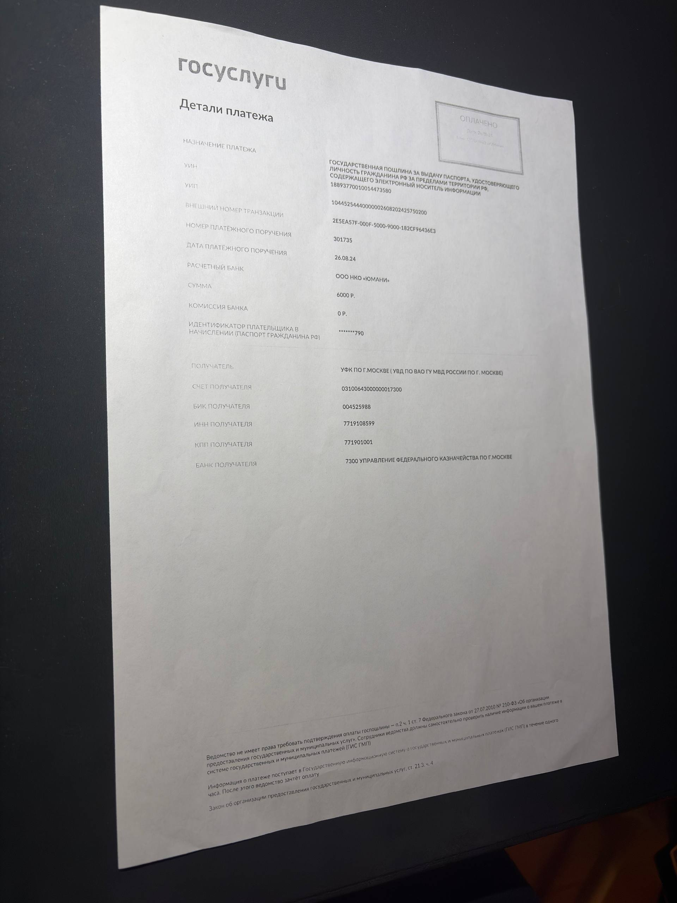
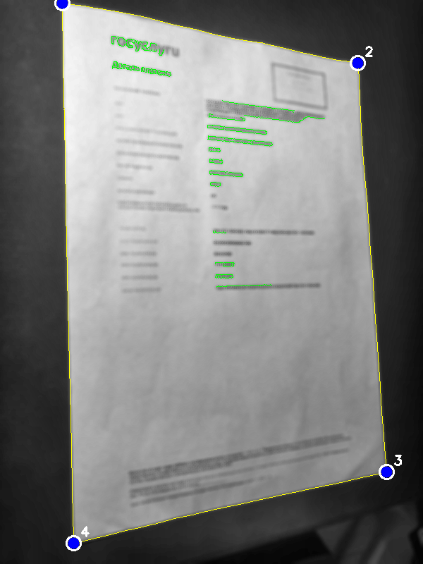
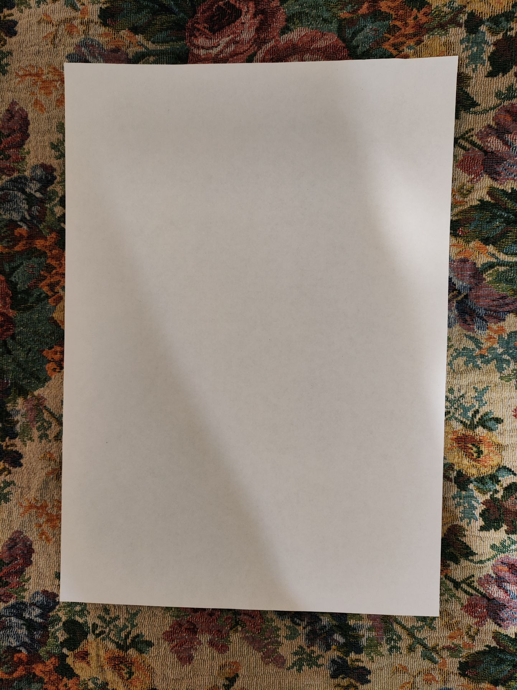
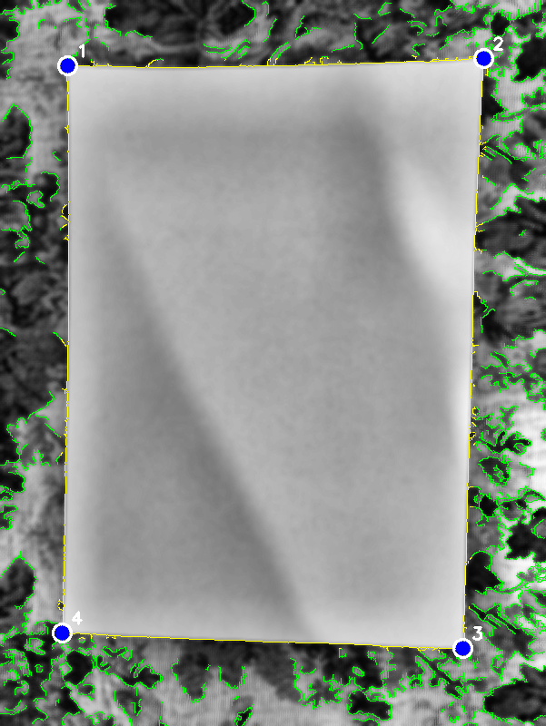
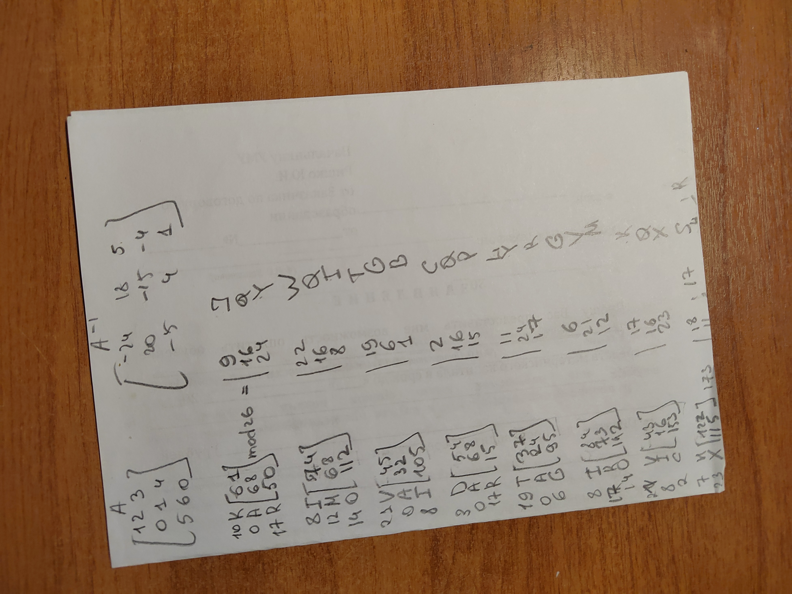
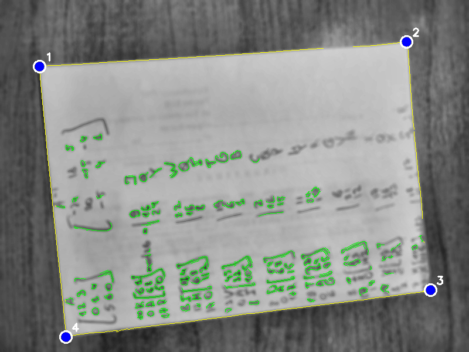

  

<i>Рис. 1. img_001. </i>
  

[json для img_001](../src/img_001.json)

  

<i>Рис. 2. Визуализация работы Canny с отмеченными точками эталона (синие), линииями совпадения контура (желтые) и остальными найденными контурами (зеленые) для img_001. </i>
  

  

<i>Рис. 3. img_057. </i>
  

[json для img_057](../src/img_057.json)

  

<i>Рис. 4. Визуализация работы Canny с отмеченными точками эталона (синие), линииями совпадения контура (желтые) и остальными найденными контурами (зеленые) для img_057. </i>
  

  

<i>Рис. 5. img_015. </i>
  

[json для img_015](../src/img_015.json)

  

<i>Рис. 6. Визуализация работы Canny с отмеченными точками эталона (синие), линииями совпадения контура (желтые) и остальными найденными контурами (зеленые) для img_015. </i>
  

**Для оценки качества Canny была посчитана IoU метрика по площади  **

Для img_001:  
| Metric | Value |
|--------|-------|
| IoU | 0.957 |
| Overlap with GT: | 99.3% |

Для img_057:  
| Metric | Value |
|--------|-------|
| IoU | 0.615 |
| Overlap with GT: | 100.0% |

Для img_015:  
| Metric | Value |
|--------|-------|
| IoU | 0.759 |
| Overlap with GT: | 94.4% |
